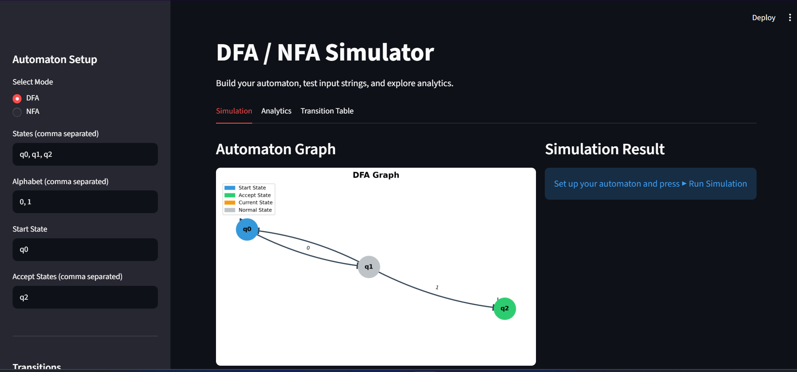
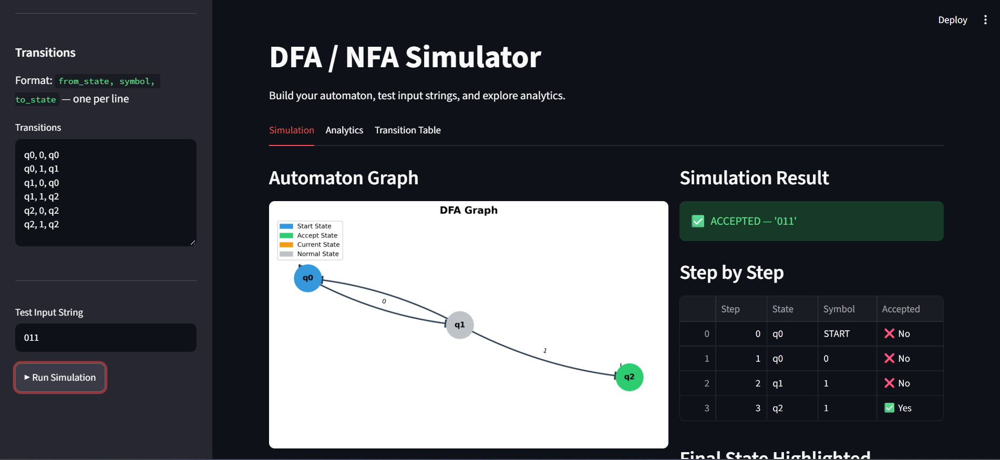
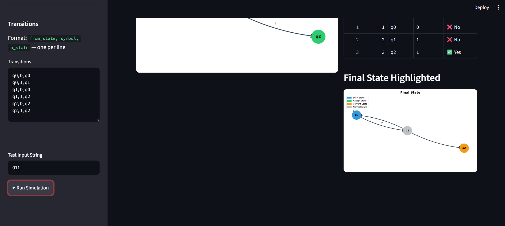
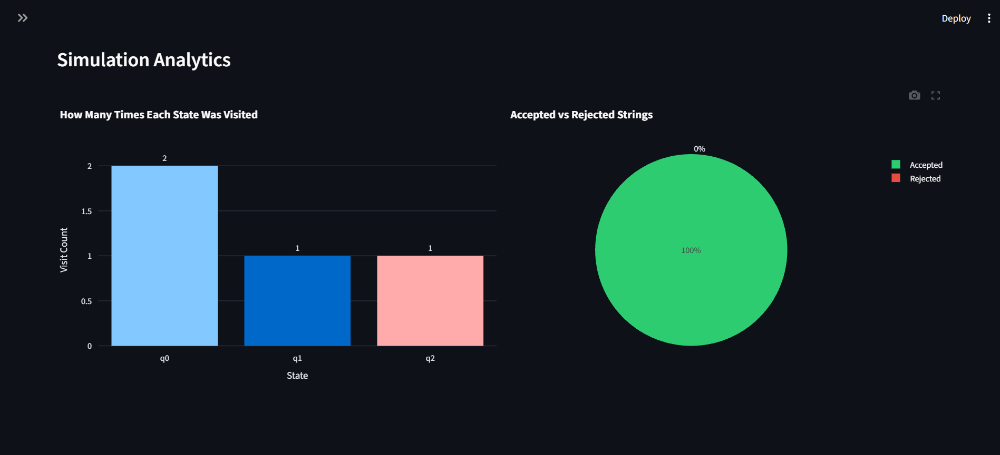
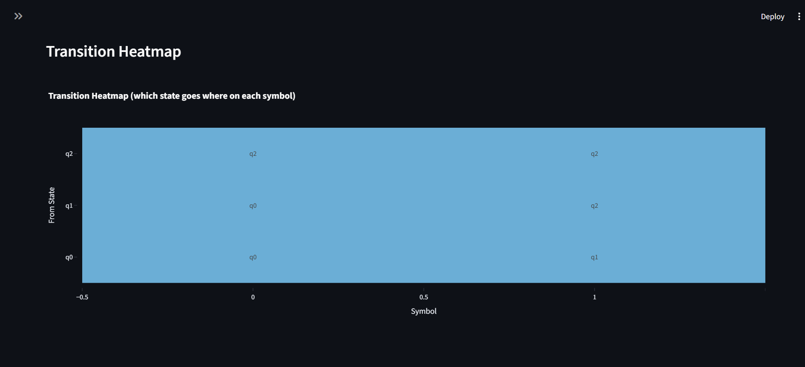

# DFA-NFA-Simulator
# DFA / NFA Simulator

An interactive web-based simulator for Deterministic Finite Automata (DFA) and Non-deterministic Finite Automata (NFA), built as a Theory of Automata course project.

## Live Demo

Run locally with:
```bash
streamlit run app.py
```

## Features

- Build and visualize DFA and NFA through an interactive web interface
- Step-by-step simulation of input strings with state highlighting
- Analytics dashboard showing state visit frequency and acceptance rate
- Transition heatmap for visual analysis of automaton structure
- Save and load automata as JSON files

## Tech Stack

| Tool | Purpose |
|---|---|
| Python | Core language |
| Streamlit | Web application framework |
| Matplotlib | Automaton graph drawing |
| NetworkX | Graph/network structure |
| Pandas | Simulation data tables |
| Plotly | Interactive analytics charts |

## Project Structure
```bash
DFA-NFA-Simulator/
├── app.py                  # Streamlit web app
├── automata/
│   ├── dfa.py              # DFA engine with step-by-step simulation
│   ├── nfa.py              # NFA engine with ε-closure computation
├── visualizer/
│   ├── graph.py            # Automaton graph drawing with matplotlib
│   └── analytics.py        # Pandas and Plotly analytics charts
└── utils/
└── file_handler.py     # JSON save and load
```
## Installation

```bash
git clone https://github.com/Beshair-Khan/DFA-NFA-Simulator.git
cd DFA-NFA-Simulator
pip install -r requirements.txt
streamlit run app.py
```

## How to Use

1. Select **DFA** or **NFA** mode from the sidebar
2. Enter states, alphabet, start state, and accept states
3. Define transitions in the format `from_state, symbol, to_state`
4. Enter a test input string
5. Click **▶ Run Simulation**
6. Explore the **Simulation**, **Analytics**, and **Transition Table** tabs

## Analytics Features

- **State Visit Bar Chart** — how many times each state was visited
- **Accepted vs Rejected Pie Chart** — string acceptance rate
- **Transition Heatmap** — visual map of all transitions

## Theory Background

A **DFA** is a 5-tuple (Q, Σ, δ, q₀, F) where every state has exactly one transition per symbol. An **NFA** allows multiple transitions per symbol and ε (epsilon) transitions — moving between states without reading any input. This simulator handles both models and computes ε-closure automatically for NFA simulation.

## Screenshots

### Main Interface & Automaton Graph


### Step-by-Step Simulation



### Analytics Dashboard


### Transition Heatmap


## Author

**Beshair Khan**  
Course: Theory of Automata (University Project)